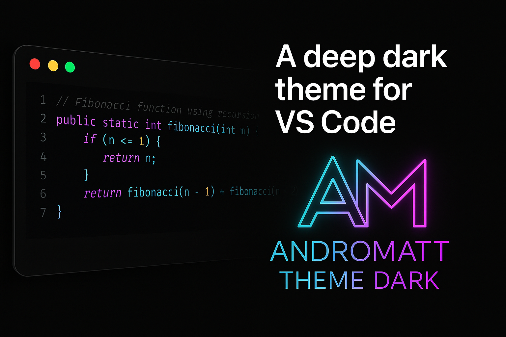
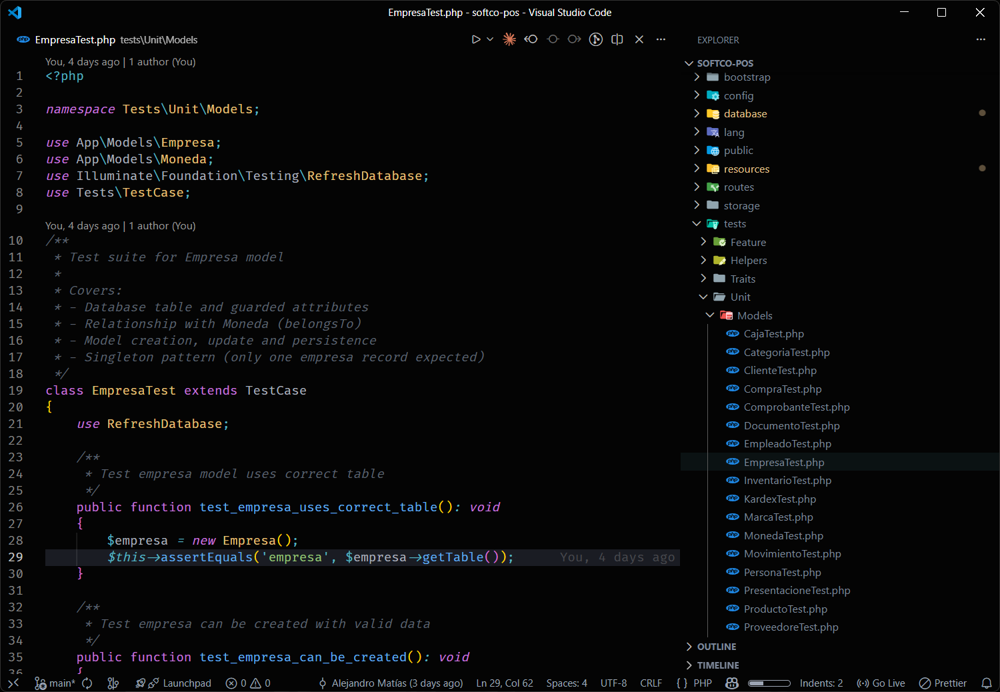
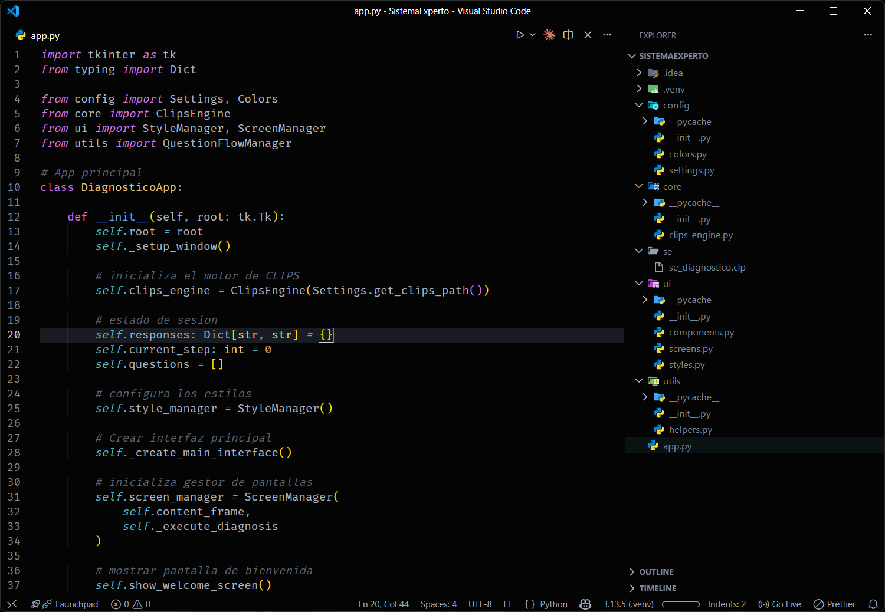

# AndroMatt Theme Dark 🌌

[](https://github.com/andromatt/AndroMatt-Theme-Dark)
[](https://github.com/andromatt/AndroMatt-Theme-Dark/LICENSE)
[](https://github.com/andromatt/AndroMatt-Theme-Dark)

> Una experiencia oscura profunda, minimalista y de alto contraste inspirada en la estética Vira Carbon.

**AndroMatt Theme Dark** es un tema refinado diseñado para largas sesiones de código, eliminando distracciones visuales con un fondo oscuro y una paleta de colores de sintaxis vibrante pero relajante.



## ✨ Características Principales

- **🖤 Fondo Negro Profundo (`#040404`):** Un lienzo infinito que se funde con los marcos de tu monitor, optimizado para pantallas OLED y trabajo nocturno.
- **🚫 Diseño "Borderless":** Interfaz sin bordes ruidosos. El editor, la barra lateral y los paneles fluyen en una sola superficie oscura.
- **🎨 Sintaxis Vivid Carbon:** Paleta de colores ajustada para Java, Python y Web Development:
  - **Keywords:** Morado y Cursiva (`class`, `return`, `import`) para un flujo de lectura elegante.
  - **Variables:** Blanco Mate para reducir la fatiga visual.
  - **Acentos:** Cyan Neón (`#56b6c2`) y Azul Eléctrico (`#528bff`) para elementos interactivos.
- **⚡ Detalles Premium:**
  - Botones y cursores unificados en azul neón.
  - Selección de texto estilo "Matrix" (Cyan transparente).
  - Resaltado de ocurrencias inteligente (Cyan para lectura, Morado para escritura).

## 📸 Capturas de Pantalla

|                 Web                 |                  Python                  |
| :---------------------------------: | :--------------------------------------: |
|  |  |

## ⚙️ Configuración Recomendada

Para obtener la inmersión total tal como fue diseñada, recomienda agregar esto a tu `settings.json`:

```json
{
  "editor.fontFamily": "'Fira Code', 'JetBrains Mono', monospace",
  "editor.fontLigatures": true,
  "window.menuBarVisibility": "compact",
  "editor.renderWhitespace": "selection",
  "workbench.tree.indent": 15,
  "editor.cursorBlinking": "smooth"
}
```
